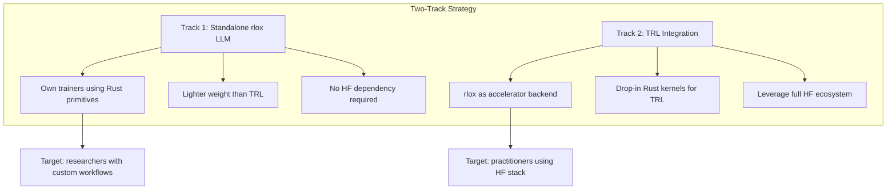
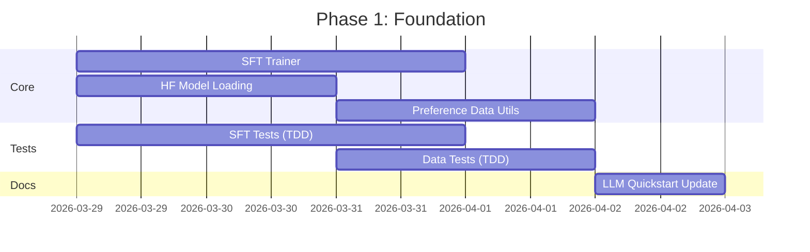
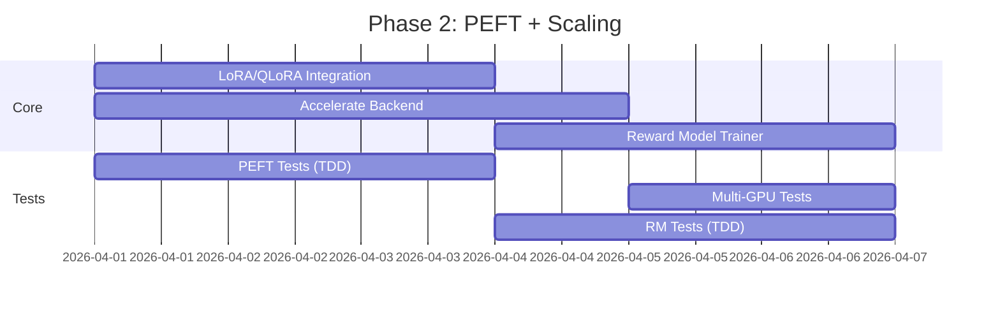
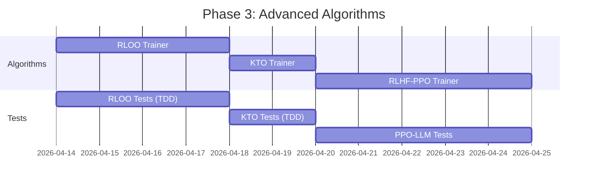
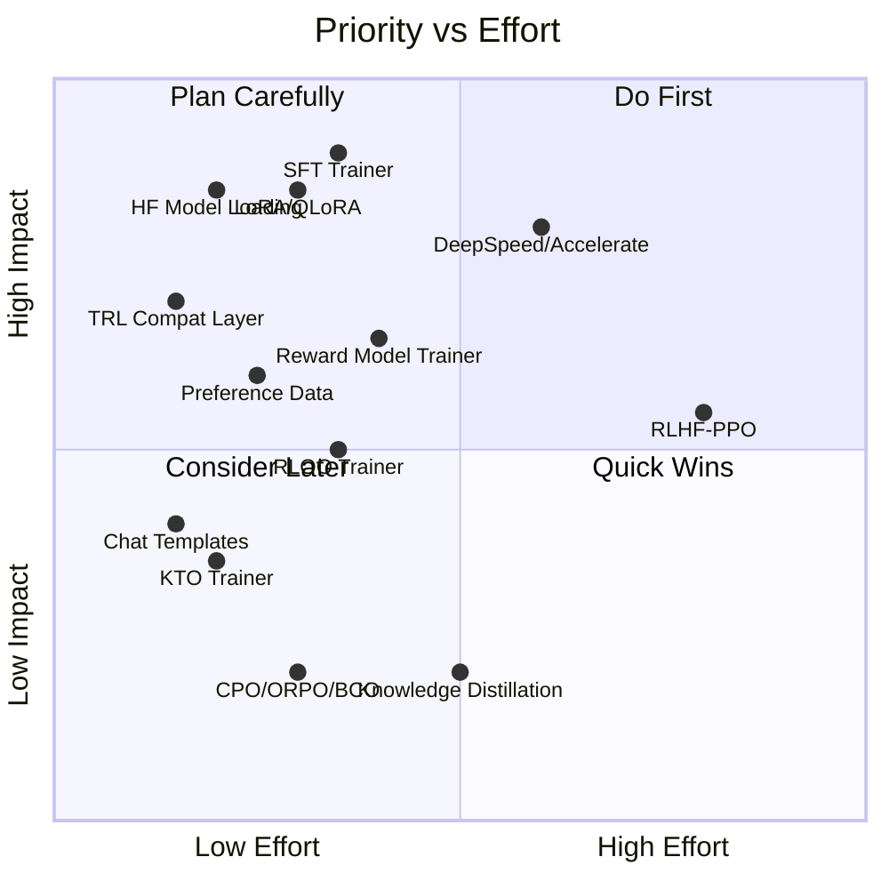

# rlox vs TRL: Gap Analysis & Closure Plan

## Current State

rlox excels at **Rust-accelerated primitives** (2.7–35x faster KL, GRPO advantages, sequence packing) and **general RL algorithms** (PPO, SAC, TD3, DQN, IMPALA, DreamerV3). TRL excels at **full LLM alignment stack** with deep HuggingFace ecosystem integration.

---

## Feature Comparison

### Algorithms / Trainers

| Method | TRL | rlox | Gap |
|--------|-----|------|-----|
| **SFT** (Supervised Fine-Tuning) | `SFTTrainer` | ✗ | High |
| **GRPO** (Group Relative Policy Optimization) | `GRPOTrainer` ⚡️ vLLM | `GRPO` | Parity (rlox faster primitives) |
| **DPO** (Direct Preference Optimization) | `DPOTrainer` | `DPO` | Parity |
| **OnlineDPO** | `OnlineDPOTrainer` ⚡️ | `OnlineDPO` | Parity |
| **PPO for RLHF** | `PPOTrainer` 🧪 | ✗ | High |
| **RLOO** (REINFORCE Leave-One-Out) | `RLOOTrainer` ⚡️ | ✗ | Medium |
| **KTO** (Kahneman-Tversky Optimization) | `KTOTrainer` 🧪 | ✗ | Low |
| **CPO** (Contrastive Preference Optimization) | `CPOTrainer` 🧪 | ✗ | Low |
| **ORPO** (Odds Ratio Preference Optimization) | `ORPOTrainer` 🧪 | ✗ | Low |
| **BCO** (Binary Classifier Optimization) | `BCOTrainer` 🧪 | ✗ | Low |
| **NashMD** (Nash Mirror Descent) | `NashMDTrainer` 🧪 | ✗ | Low |
| **XPO** (Exploratory Preference Optimization) | `XPOTrainer` 🧪 | ✗ | Low |
| **Reward Model Training** | `RewardTrainer` | ✗ (serving only) | High |
| **Process Reward Model** | `PRMTrainer` 🧪 | ✗ | Medium |
| **Knowledge Distillation** | `GKDTrainer`, `MiniLLMTrainer` | ✗ | Low |
| **Best-of-N** | ✗ | `BestOfN` | rlox advantage |

### Infrastructure

| Feature | TRL | rlox | Gap |
|---------|-----|------|-----|
| **HF Transformers integration** | Native | Manual model loading | High |
| **LoRA / QLoRA (PEFT)** | Built-in | ✗ | High |
| **DeepSpeed ZeRO (1/2/3)** | Via Accelerate | ✗ | High |
| **FSDP** | Via Accelerate | ✗ | Medium |
| **vLLM generation** | Native ⚡️ | HTTP client | Partial |
| **Multi-GPU (DDP)** | Via Accelerate | `MultiGPUTrainer` | Parity |
| **Quantization (4-bit/8-bit)** | BitsAndBytes | ✗ | Medium |
| **Unsloth kernel optimization** | Integrated | ✗ | Low |
| **Liger Kernel** | Integrated | ✗ | Low |
| **OpenEnv (Meta)** | Integrated | ✗ | Low |
| **CLI training** | `trl sft`, `trl dpo` | `python -m rlox train` | Partial |
| **Mixed precision (bf16/fp16)** | Via Accelerate | Manual PyTorch AMP | Low |

### Data Handling

| Feature | TRL | rlox | Gap |
|---------|-----|------|-----|
| **Chat templates** | Built-in (Jinja2) | ✗ | Medium |
| **Preference datasets** | HF datasets integration | Manual | Medium |
| **Tokenization** | HF tokenizers | Manual | Medium |
| **Sequence packing** | Supported | Rust-accelerated `pack_sequences()` | rlox advantage |
| **Data collation** | Built-in | ✗ | Low |

### Rust-Accelerated Primitives (rlox unique)

| Primitive | Speedup vs TRL |
|-----------|---------------|
| `compute_batch_group_advantages()` | 4–14x |
| `compute_batch_token_kl()` | 2.7–5.5x |
| `compute_batch_token_kl_schulman()` | 2.7–5.5x |
| `pack_sequences()` | Rust, not in TRL |
| `VarLenStore` | Rust, not in TRL |

---

## Gap Closure Plan

### Architecture Decision



**Recommended: Both tracks in parallel.** Track 1 makes rlox self-sufficient for common workflows. Track 2 maximizes reach by plugging into TRL's ecosystem.

---

### Phase 1: Foundation (Weeks 1–2)

> Goal: Make rlox usable end-to-end for the most common LLM training workflow (SFT → DPO/GRPO)

#### 1.1 SFT Trainer
**Priority: HIGH** — Required before any preference optimization.

```python
# Target API
from rlox.llm import SFTTrainer

trainer = SFTTrainer(
    model="meta-llama/Llama-3.2-1B",  # or nn.Module
    dataset=my_dataset,                # list[dict] or HF Dataset
    max_seq_length=2048,
    packing=True,                      # uses rlox.pack_sequences()
)
trainer.train(n_epochs=3)
```

**Implementation:**
- `python/rlox/llm/sft_trainer.py` (~150 lines)
- Wraps PyTorch training loop with rlox's `pack_sequences()` for efficiency
- Accepts either HF model ID (lazy `transformers` import) or raw `nn.Module`
- Support `packing=True` using Rust `pack_sequences()`
- Callback + logger integration (reuse existing system)

**Files:** New `python/rlox/llm/sft_trainer.py`

#### 1.2 HuggingFace Model Loading
**Priority: HIGH** — Most users start from pretrained HF models.

```python
from rlox.llm import load_model

model, tokenizer = load_model("meta-llama/Llama-3.2-1B")
# Optional: load_model("meta-llama/Llama-3.2-1B", quantize="4bit")
```

**Implementation:**
- `python/rlox/llm/model_utils.py` (~80 lines)
- Thin wrapper: `AutoModelForCausalLM.from_pretrained()` + `AutoTokenizer`
- Optional 4-bit/8-bit via `BitsAndBytesConfig` (if installed)
- Graceful fallback if `transformers` not installed

**Files:** New `python/rlox/llm/model_utils.py`

#### 1.3 Preference Data Utilities
**Priority: MEDIUM** — Reduces boilerplate for DPO/GRPO users.

```python
from rlox.llm import PreferenceDataset

dataset = PreferenceDataset.from_dict([
    {"prompt": "...", "chosen": "...", "rejected": "..."},
])
# or
dataset = PreferenceDataset.from_hf("Anthropic/hh-rlhf")
```

**Implementation:**
- `python/rlox/llm/data.py` (~100 lines)
- Tokenization + padding + collation
- Support dict format and HF datasets (lazy import)

**Files:** New `python/rlox/llm/data.py`



---

### Phase 2: PEFT + Scaling (Weeks 3–4)

> Goal: Enable training 7B–70B models on consumer/cloud GPUs.

#### 2.1 LoRA / QLoRA Integration
**Priority: HIGH** — Without this, rlox can't train models >3B on typical hardware.

```python
from rlox.llm import load_model, SFTTrainer

model, tokenizer = load_model(
    "meta-llama/Llama-3.2-8B",
    quantize="4bit",
    lora_r=16,
    lora_alpha=32,
    lora_target_modules=["q_proj", "v_proj"],
)
trainer = SFTTrainer(model=model, dataset=data)
trainer.train()
```

**Implementation:**
- `python/rlox/llm/peft_utils.py` (~60 lines)
- Thin wrapper around `peft.get_peft_model()` + `LoraConfig`
- Integrate into `load_model()` as optional params
- Works with all existing trainers (DPO, GRPO, SFT)

#### 2.2 Accelerate / DeepSpeed Backend
**Priority: HIGH** — Required for multi-GPU training of large models.

```python
from rlox.llm import SFTTrainer

# Automatically uses accelerate if available
# Launch: accelerate launch --config_file ds_config.yaml train.py
trainer = SFTTrainer(model=model, dataset=data)
trainer.train()  # Uses DeepSpeed ZeRO-2 if configured
```

**Implementation:**
- `python/rlox/llm/accelerate_backend.py` (~100 lines)
- Wrap optimizer + model with `accelerate.Accelerator`
- Support DeepSpeed ZeRO configs via accelerate
- Gradient accumulation helper

#### 2.3 Reward Model Trainer
**Priority: MEDIUM** — Needed for full RLHF pipeline.

```python
from rlox.llm import RewardTrainer

trainer = RewardTrainer(
    model="meta-llama/Llama-3.2-1B",
    dataset=preference_data,  # (prompt, chosen, rejected) pairs
)
trainer.train(n_epochs=1)
```

**Implementation:**
- `python/rlox/llm/reward_trainer.py` (~120 lines)
- Bradley-Terry pairwise loss
- Adds scalar value head to LM
- Reuses preference data utilities from Phase 1



---

### Phase 3: Advanced Algorithms (Weeks 5–6)

> Goal: Algorithm parity with TRL's most-used methods.

#### 3.1 RLOO Trainer (REINFORCE Leave-One-Out)
**Priority: MEDIUM** — Simpler than PPO, no value model needed, competitive results.

```python
from rlox.llm import RLOOTrainer

trainer = RLOOTrainer(
    model=model,
    reward_fn=my_reward_fn,
    rloo_k=4,  # leave-one-out with K samples
)
trainer.train(prompts)
```

**Implementation:**
- `python/rlox/algorithms/rloo.py` (~120 lines)
- Similar to GRPO but uses leave-one-out baseline instead of group mean
- Reuses `compute_batch_token_kl()` for KL penalty
- Can use Rust `compute_batch_group_advantages()` with modification

#### 3.2 KTO Trainer (Kahneman-Tversky Optimization)
**Priority: LOW-MEDIUM** — Requires only binary feedback (thumbs up/down), not paired preferences.

```python
from rlox.llm import KTOTrainer

trainer = KTOTrainer(
    model=model,
    ref_model=ref_model,
    dataset=binary_feedback_data,  # (prompt, completion, label: bool)
)
```

**Implementation:**
- `python/rlox/algorithms/kto.py` (~80 lines)
- Loss: asymmetric sigmoid on log-ratio (different weights for positive/negative)
- Simpler than DPO (no paired data needed)

#### 3.3 RLHF-PPO Trainer
**Priority: MEDIUM** — Classic RLHF pipeline, being replaced by GRPO/DPO but still widely used.

```python
from rlox.llm import PPOTrainer as LLMPPOTrainer

trainer = LLMPPOTrainer(
    model=model,
    ref_model=ref_model,
    reward_model=reward_model,
    value_model=value_model,
)
trainer.train(prompts)
```

**Implementation:**
- `python/rlox/llm/ppo_trainer.py` (~300 lines)
- Token-level advantages with GAE (reuse `rlox.compute_gae`)
- KL penalty in reward
- 4-model architecture: policy, ref, reward, value
- Most complex trainer — consider lower priority than RLOO



---

### Phase 4: TRL Integration Track (Weeks 3–4, parallel)

> Goal: rlox as a drop-in accelerator for TRL users.

#### 4.1 TRL-Compatible Rust Kernels Package

```python
# In TRL training script, just add:
import rlox.trl_compat  # monkey-patches TRL with Rust kernels

# Or explicit:
from rlox.trl_compat import rust_group_advantages, rust_token_kl
```

**Implementation:**
- `python/rlox/trl_compat.py` (~50 lines)
- Replaces TRL's `compute_group_advantages` with `rlox.compute_batch_group_advantages`
- Replaces TRL's KL computation with `rlox.compute_batch_token_kl_schulman`
- Transparent: same inputs/outputs, just faster

#### 4.2 rlox as pip-installable TRL backend

```toml
# pyproject.toml
[project.optional-dependencies]
trl = ["trl>=0.12", "transformers", "peft"]
```

---

## Implementation Priority Matrix



## Summary: What to Build

| Phase | Items | Timeline | Lines of Code |
|-------|-------|----------|---------------|
| **Phase 1** | SFT Trainer, HF model loading, preference data utils | Weeks 1–2 | ~330 |
| **Phase 2** | LoRA/QLoRA, Accelerate/DeepSpeed, Reward Trainer | Weeks 3–4 | ~280 |
| **Phase 3** | RLOO, KTO, RLHF-PPO | Weeks 5–6 | ~500 |
| **Phase 4** | TRL compat layer (parallel) | Weeks 3–4 | ~50 |

**Total estimated new code: ~1,160 lines** (plus tests)

## What NOT to Build

- **CPO, ORPO, BCO, NashMD, XPO** — TRL marks these as 🧪 experimental. Wait for community adoption before implementing.
- **Knowledge distillation (GKD, MiniLLM)** — Niche use case, low demand.
- **Unsloth / Liger kernels** — These are PyTorch-level optimizations. rlox's value is Rust data-plane acceleration, not kernel fusion. Let users combine rlox + Unsloth independently.
- **OpenEnv integration** — Meta-specific, too early to invest.

## File Structure

```
python/rlox/llm/
├── __init__.py           # Public API exports
├── sft_trainer.py        # Phase 1: SFT
├── model_utils.py        # Phase 1: HF model loading
├── data.py               # Phase 1: Preference data utilities
├── peft_utils.py         # Phase 2: LoRA/QLoRA
├── accelerate_backend.py # Phase 2: DeepSpeed/FSDP
├── reward_trainer.py     # Phase 2: RM training
├── reward_models.py      # Existing: RM serving
├── vllm_backend.py       # Existing: vLLM/TGI clients
└── ppo_trainer.py        # Phase 3: RLHF-PPO

python/rlox/algorithms/
├── rloo.py               # Phase 3: RLOO
├── kto.py                # Phase 3: KTO
├── dpo.py                # Existing
├── grpo.py               # Existing
├── online_dpo.py         # Existing
└── best_of_n.py          # Existing

python/rlox/trl_compat.py # Phase 4: TRL drop-in acceleration
```
