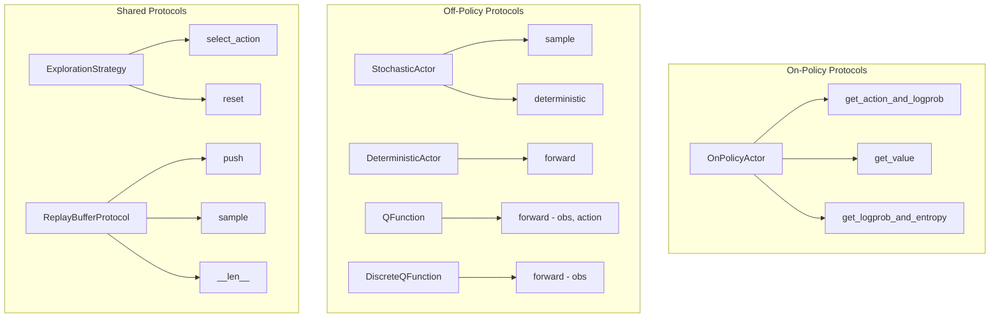

# Custom Components Tutorial

rlox is designed to be extensible. You can bring your own networks, exploration strategies, loss functions, and compose them using the builder pattern.

## Protocols — What Your Custom Components Must Implement

rlox uses Python Protocols (structural subtyping) — your custom class just needs to implement the right methods. No inheritance required.



## Example 1: Custom CNN Policy for PPO

```python
import torch
import torch.nn as nn

class MyCNNPolicy(nn.Module):
    """Custom CNN policy that satisfies OnPolicyActor protocol."""

    def __init__(self, obs_shape, n_actions):
        super().__init__()
        self.features = nn.Sequential(
            nn.Conv2d(obs_shape[0], 32, 8, stride=4),
            nn.ReLU(),
            nn.Conv2d(32, 64, 4, stride=2),
            nn.ReLU(),
            nn.Flatten(),
        )
        # Compute feature size
        with torch.no_grad():
            dummy = torch.zeros(1, *obs_shape)
            feat_size = self.features(dummy).shape[1]

        self.actor = nn.Linear(feat_size, n_actions)
        self.critic = nn.Linear(feat_size, 1)

    def get_action_and_logprob(self, obs):
        features = self.features(obs)
        logits = self.actor(features)
        dist = torch.distributions.Categorical(logits=logits)
        action = dist.sample()
        return action, dist.log_prob(action)

    def get_value(self, obs):
        features = self.features(obs)
        return self.critic(features).squeeze(-1)

    def get_logprob_and_entropy(self, obs, actions):
        features = self.features(obs)
        logits = self.actor(features)
        dist = torch.distributions.Categorical(logits=logits)
        return dist.log_prob(actions), dist.entropy()

# Use with PPO — protocol check happens automatically
from rlox.algorithms.ppo import PPO

ppo = PPO(env_id="CartPole-v1", policy=MyCNNPolicy((4,), 2))
ppo.train(total_timesteps=50_000)
```

## Example 2: Custom Networks for Off-Policy Algorithms

SAC, TD3, and DQN now accept custom networks via `actor=`, `critic=`, `q_network=`, and `buffer=` parameters:

```python
from rlox.algorithms.sac import SAC
from rlox.algorithms.td3 import TD3
from rlox.algorithms.dqn import DQN
import torch.nn as nn

# --- SAC with custom CNN actor and critic ---

class MyCNNActor(nn.Module):
    """Custom CNN actor that satisfies StochasticActor protocol."""
    def __init__(self, obs_shape, act_dim):
        super().__init__()
        self.features = nn.Sequential(
            nn.Conv2d(obs_shape[0], 32, 8, stride=4), nn.ReLU(),
            nn.Conv2d(32, 64, 4, stride=2), nn.ReLU(),
            nn.Flatten(),
        )
        with torch.no_grad():
            feat_size = self.features(torch.zeros(1, *obs_shape)).shape[1]
        self.mean = nn.Linear(feat_size, act_dim)
        self.log_std = nn.Parameter(torch.zeros(act_dim))

    def sample(self, obs):
        features = self.features(obs)
        mean = torch.tanh(self.mean(features))
        std = self.log_std.exp().expand_as(mean)
        dist = torch.distributions.Normal(mean, std)
        action = dist.rsample()
        log_prob = dist.log_prob(action).sum(-1)
        return action, log_prob

    def deterministic(self, obs):
        return torch.tanh(self.mean(self.features(obs)))

# Inject custom actor — SAC handles everything else
sac = SAC(env_id="Pendulum-v1", actor=MyCNNActor((3,), 1), learning_starts=1000)
sac.train(total_timesteps=50_000)

# --- TD3 with custom critic ---

class MyWideCritic(nn.Module):
    """Wider critic network."""
    def __init__(self, obs_dim, act_dim):
        super().__init__()
        self.net = nn.Sequential(
            nn.Linear(obs_dim + act_dim, 512), nn.ReLU(),
            nn.Linear(512, 512), nn.ReLU(),
            nn.Linear(512, 1),
        )
    def forward(self, obs, action):
        return self.net(torch.cat([obs, action], dim=-1))

td3 = TD3(env_id="Pendulum-v1", critic=MyWideCritic(3, 1))

# --- DQN with custom Q-network ---

class MyDuelingNet(nn.Module):
    """Custom dueling architecture with attention."""
    def __init__(self, obs_dim, n_actions):
        super().__init__()
        self.shared = nn.Sequential(nn.Linear(obs_dim, 128), nn.ReLU())
        self.value = nn.Linear(128, 1)
        self.advantage = nn.Linear(128, n_actions)

    def forward(self, obs):
        features = self.shared(obs)
        v = self.value(features)
        a = self.advantage(features)
        return v + a - a.mean(dim=-1, keepdim=True)

dqn = DQN(env_id="CartPole-v1", q_network=MyDuelingNet(4, 2))

# --- Custom replay buffer ---
import rlox
mmap_buf = rlox.MmapReplayBuffer(
    hot_capacity=10_000, total_capacity=500_000,
    obs_dim=4, act_dim=1, cold_path="/tmp/replay.bin"
)
dqn = DQN(env_id="CartPole-v1", buffer=mmap_buf)
```

## Example 3: Custom Exploration Strategy

```python
from rlox.exploration import OUNoise, GaussianNoise, EpsilonGreedy

# Ornstein-Uhlenbeck noise (temporally correlated)
noise = OUNoise(action_dim=1, sigma=0.3, theta=0.15)

# Gaussian noise (i.i.d.)
noise = GaussianNoise(sigma=0.1, clip=0.3)

# Epsilon-greedy with custom decay
noise = EpsilonGreedy(n_actions=4, eps_start=1.0, eps_end=0.01, decay_fraction=0.2)
```

## Example 3: Builder Pattern

```python
from rlox.builders import SACBuilder, PPOBuilder, DQNBuilder
from rlox.exploration import OUNoise
from rlox.callbacks import EvalCallback, ProgressBarCallback

# Simple SAC
sac = SACBuilder().env("Pendulum-v1").build()

# Customized SAC
sac = (SACBuilder()
    .env("Pendulum-v1")
    .learning_rate(1e-4)
    .hidden(256)
    .tau(0.01)
    .exploration(OUNoise(action_dim=1, sigma=0.2))
    .callbacks([EvalCallback(eval_freq=5000), ProgressBarCallback()])
    .compile(True)
    .build())

sac.train(total_timesteps=50_000)

# PPO with custom policy
from rlox.policies import DiscretePolicy
ppo = (PPOBuilder()
    .env("CartPole-v1")
    .policy(DiscretePolicy(obs_dim=4, n_actions=2, hidden=128))
    .n_envs(16)
    .n_steps(256)
    .learning_rate(2.5e-4)
    .compile(True)
    .build())

# DQN with Rainbow
dqn = (DQNBuilder()
    .env("CartPole-v1")
    .double_dqn(True)
    .dueling(True)
    .prioritized(True)
    .build())
```

## Example 4: Composable Losses

```python
import torch
from rlox.losses import LossComponent, CompositeLoss, PPOLoss

# Custom auxiliary loss
class RepresentationLoss(LossComponent):
    """Encourage diverse feature representations."""

    def __init__(self, coef=0.01):
        self.coef = coef

    def compute(self, **kwargs):
        obs = kwargs.get("obs")
        if obs is None:
            return torch.tensor(0.0), {}
        # Encourage high variance in features
        variance = obs.var(dim=0).mean()
        loss = -self.coef * variance  # maximize variance
        return loss, {"repr_var": variance.item()}

# Compose with PPO loss
class KLPenalty(LossComponent):
    """KL divergence penalty against a reference policy."""

    def __init__(self, ref_policy, coef=0.1):
        self.ref_policy = ref_policy
        self.coef = coef

    def compute(self, **kwargs):
        obs = kwargs.get("obs")
        actions = kwargs.get("actions")
        if obs is None or actions is None:
            return torch.tensor(0.0), {}
        with torch.no_grad():
            ref_log_probs, _ = self.ref_policy.get_logprob_and_entropy(obs, actions)
        curr_log_probs = kwargs.get("log_probs", ref_log_probs)
        kl = (curr_log_probs - ref_log_probs).mean()
        return self.coef * kl, {"kl_penalty": kl.item()}

# Combine losses
combined = CompositeLoss([
    (1.0, RepresentationLoss(coef=0.01)),
    (0.1, KLPenalty(ref_policy, coef=0.1)),
])
loss, metrics = combined.compute(obs=obs_batch, actions=action_batch)
```

## Example 5: Custom Training Loop with rlox Components

```python
import rlox
from rlox import RolloutCollector, PPOLoss, RolloutBatch
from rlox.policies import DiscretePolicy
import torch

# Mix and match rlox components in your own loop
policy = DiscretePolicy(obs_dim=4, n_actions=2)
collector = RolloutCollector(
    env_id="CartPole-v1", n_envs=8, seed=0,
    gamma=0.99, gae_lambda=0.95,
)
loss_fn = PPOLoss(clip_eps=0.2, vf_coef=0.5, ent_coef=0.01)
optimizer = torch.optim.Adam(policy.parameters(), lr=2.5e-4)

for update in range(100):
    # Collect with rlox (Rust VecEnv + batched GAE)
    batch = collector.collect(policy, n_steps=128)

    # Your custom training logic
    for epoch in range(4):
        for mb in batch.sample_minibatches(batch_size=256):
            adv = (mb.advantages - mb.advantages.mean()) / (mb.advantages.std() + 1e-8)
            loss, metrics = loss_fn(policy, mb.obs, mb.actions, mb.log_probs,
                                     adv, mb.returns, mb.values)

            # Add your custom loss terms here
            # loss = loss + 0.01 * my_custom_loss(mb)

            optimizer.zero_grad(set_to_none=True)
            loss.backward()
            torch.nn.utils.clip_grad_norm_(policy.parameters(), 0.5)
            optimizer.step()

    if update % 10 == 0:
        print(f"Update {update}: entropy={metrics['entropy']:.3f}")
```

## Protocol Verification

You can check if your custom class satisfies a protocol at runtime:

```python
from rlox.protocols import OnPolicyActor, StochasticActor

# Check conformance
assert isinstance(my_policy, OnPolicyActor), "Missing required methods!"

# This works with any class that has the right methods
class MinimalPolicy:
    def get_action_and_logprob(self, obs): ...
    def get_value(self, obs): ...
    def get_logprob_and_entropy(self, obs, actions): ...

assert isinstance(MinimalPolicy(), OnPolicyActor)  # True!
```
