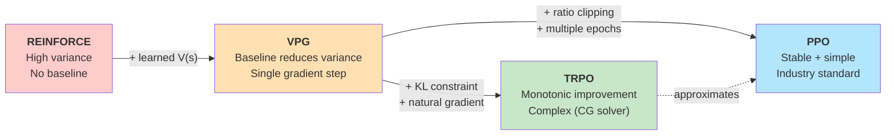

# Policy Gradient from First Principles

*From REINFORCE to PPO -- the ideas that power modern RL.*

This tutorial derives the policy gradient theorem step by step,
implements the core ideas in Python and Rust, and shows how the
progression from VPG to PPO solves each predecessor's problems.

!!! tip "Prerequisites"
    You should be comfortable with:

    - Probability basics (expectations, log-probabilities)
    - PyTorch autograd (`loss.backward()`, `optimizer.step()`)
    - The RL loop: agent observes $s$, takes action $a$, receives reward $r$

---

## 1. The RL Objective

### What are we optimizing?

In reinforcement learning we want to find a policy $\pi_\theta(a \mid s)$ --
a neural network parameterized by $\theta$ -- that maximizes the
**expected discounted return**:

$$
J(\theta) \;=\; \mathbb{E}_{\tau \sim \pi_\theta}
\left[\,\sum_{t=0}^{T} \gamma^t \, r_t \,\right]
$$

where $\tau = (s_0, a_0, r_0, s_1, a_1, r_1, \ldots)$ is a trajectory
sampled by acting according to $\pi_\theta$ in the environment, and
$\gamma \in [0, 1)$ is the discount factor.

### Why gradient-based optimization?

If the policy is a neural network, $J(\theta)$ is a differentiable
function of $\theta$ (in expectation).  We can estimate $\nabla_\theta
J(\theta)$ from sampled trajectories and do gradient *ascent* to
improve the policy, just like we do gradient descent on a loss function.

The challenge is that the expectation is over trajectories whose
distribution *depends on* $\theta$ (because the policy chooses the
actions).  We cannot simply backpropagate through the environment.

### The score function trick

The key insight is the **log-derivative trick** (also called the
*REINFORCE trick* or *score function estimator*).

For any function $f(\tau)$ and trajectory distribution $p_\theta(\tau)$:

$$
\nabla_\theta \,\mathbb{E}_{\tau \sim p_\theta}\!\left[ f(\tau) \right]
\;=\;
\mathbb{E}_{\tau \sim p_\theta}\!\left[
    f(\tau) \;\nabla_\theta \log p_\theta(\tau)
\right]
$$

??? note "Proof sketch"

    $$
    \nabla_\theta \,\mathbb{E}[f(\tau)]
    = \nabla_\theta \int p_\theta(\tau)\, f(\tau)\, d\tau
    = \int f(\tau)\, \nabla_\theta\, p_\theta(\tau)\, d\tau
    $$

    Using the identity $\nabla p = p \,\nabla \log p$:

    $$
    = \int f(\tau)\, p_\theta(\tau)\, \nabla_\theta \log p_\theta(\tau)\, d\tau
    = \mathbb{E}_{\tau \sim p_\theta}\!\left[
        f(\tau)\, \nabla_\theta \log p_\theta(\tau)
    \right]
    $$

The trajectory probability factorizes as:

$$
p_\theta(\tau) = p(s_0) \prod_{t=0}^{T}
    \pi_\theta(a_t \mid s_t)\, p(s_{t+1} \mid s_t, a_t)
$$

Taking the log and differentiating with respect to $\theta$, the
environment dynamics $p(s_{t+1} \mid s_t, a_t)$ and initial state
$p(s_0)$ drop out (they don't depend on $\theta$), leaving:

$$
\nabla_\theta \log p_\theta(\tau)
\;=\;
\sum_{t=0}^{T} \nabla_\theta \log \pi_\theta(a_t \mid s_t)
$$

This is remarkable: **we never need to differentiate through the
environment** -- only through our own policy network.

---

## 2. REINFORCE

### The simplest policy gradient

Combining the objective with the score function trick gives the
**REINFORCE** estimator (Williams, 1992):

$$
\nabla_\theta J(\theta)
\;=\;
\mathbb{E}_{\tau \sim \pi_\theta}\!\left[\,
    \sum_{t=0}^{T}
    \nabla_\theta \log \pi_\theta(a_t \mid s_t)
    \;\cdot\;
    R(\tau)
\,\right]
$$

where $R(\tau) = \sum_{t=0}^{T} \gamma^t r_t$ is the total return of
the trajectory.

In practice we estimate this from a batch of $N$ trajectories:

$$
\hat{g}
\;=\;
\frac{1}{N} \sum_{i=1}^{N} \sum_{t=0}^{T}
    \nabla_\theta \log \pi_\theta(a_t^{(i)} \mid s_t^{(i)})
    \;\cdot\;
    R(\tau^{(i)})
$$

### The log-probability trick in code

=== "Python (PyTorch)"

    ```python
    # Collect a batch of (obs, action, return) tuples
    log_probs = policy.get_log_prob(obs, actions)  # shape: (batch,)
    returns   = compute_returns(rewards, gamma)     # shape: (batch,)

    # REINFORCE loss (negative because optimizers minimize)
    loss = -(log_probs * returns).mean()

    optimizer.zero_grad()
    loss.backward()
    optimizer.step()
    ```

=== "Rust (rlox internals)"

    ```rust
    // In rlox the log-prob computation happens inside the Python policy,
    // but the return/advantage computation is done in Rust for speed:
    //
    //   let (advantages, returns) = compute_gae(
    //       &rewards, &values, &dones, gamma, gae_lambda,
    //   );
    //
    // The Rust GAE is ~10x faster than a pure-Python loop.
    ```

### Why REINFORCE has high variance

Every action in the trajectory is multiplied by the **same** total
return $R(\tau)$.  An action taken at $t=0$ gets credit for rewards at
$t=100$, even though it probably had nothing to do with them.

This makes the gradient estimate extremely noisy.  Training is slow
and unstable.  We need variance reduction.

---

## 3. Reducing Variance

### Reward-to-go (causality)

An action at time $t$ cannot affect rewards at times $t' < t$.  So
we replace the total return with the **reward-to-go**:

$$
\hat{R}_t = \sum_{t'=t}^{T} \gamma^{t'-t} \, r_{t'}
$$

The policy gradient becomes:

$$
\hat{g}
\;=\;
\frac{1}{N} \sum_{i=1}^{N} \sum_{t=0}^{T}
    \nabla_\theta \log \pi_\theta(a_t \mid s_t)
    \;\cdot\;
    \hat{R}_t
$$

This reduces variance without introducing any bias.

### Baselines

We can subtract any function $b(s_t)$ that does not depend on
$a_t$ from the return, and the expected gradient remains unchanged:

$$
\hat{g}
\;=\;
\mathbb{E}\!\left[\,
    \sum_{t}
    \nabla_\theta \log \pi_\theta(a_t \mid s_t)
    \;\cdot\;
    \bigl(\hat{R}_t - b(s_t)\bigr)
\,\right]
$$

??? note "Why baselines don't change the expected gradient"

    For any baseline $b(s)$:

    $$
    \mathbb{E}_{a \sim \pi_\theta(\cdot|s)}\!\left[
        \nabla_\theta \log \pi_\theta(a|s) \;\cdot\; b(s)
    \right]
    \;=\;
    b(s) \;\cdot\; \nabla_\theta \underbrace{
        \sum_a \pi_\theta(a|s)
    }_{=\,1}
    \;=\; 0
    $$

    So subtracting $b(s)$ from the return adds zero in expectation but
    can dramatically reduce variance.

The optimal baseline (in the MSE sense) is $b(s_t) = V^\pi(s_t)$,
the state-value function.  This gives us the **advantage**:

$$
A^\pi(s_t, a_t) = \hat{R}_t - V^\pi(s_t)
$$

Positive advantage means "this action was better than average";
negative means "worse than average".  This is much more informative
than raw returns.

### VPG = REINFORCE + learned baseline

**Vanilla Policy Gradient (VPG)** trains a value function $V_\phi(s)$
alongside the policy and uses it as a baseline:

```python
# Policy gradient with learned baseline
advantages = returns - V(obs)         # A(s,a) = R_t - V(s_t)
policy_loss = -(log_probs * advantages.detach()).mean()

# Value function regression
vf_loss = ((V(obs) - returns) ** 2).mean()
```

!!! warning "Detach the advantages"
    When computing the policy loss, `advantages` must be `.detach()`'ed
    so that the policy gradient does not flow through the value function.

---

## 4. GAE -- Generalized Advantage Estimation

### The bias-variance tradeoff

Using $A_t = R_t - V(s_t)$ with Monte Carlo returns $R_t$ gives an
*unbiased* but high-variance estimate.

Using the 1-step TD error $\delta_t = r_t + \gamma V(s_{t+1}) - V(s_t)$
as the advantage gives a *low-variance* but *biased* estimate (biased
because $V$ is approximate).

**GAE** (Schulman et al., 2016) interpolates between the two using a
parameter $\lambda \in [0, 1]$:

$$
\hat{A}_t^{\text{GAE}(\gamma, \lambda)}
\;=\;
\sum_{\ell=0}^{\infty}
(\gamma \lambda)^\ell \;\delta_{t+\ell}
$$

where $\delta_t = r_t + \gamma V(s_{t+1}) - V(s_t)$ is the TD residual.

| $\lambda$ | Behavior |
|---|---|
| $\lambda = 0$ | 1-step TD: $\hat{A}_t = \delta_t$ (low variance, high bias) |
| $\lambda = 1$ | Monte Carlo: $\hat{A}_t = R_t - V(s_t)$ (no bias, high variance) |
| $\lambda \approx 0.95$--$0.97$ | Sweet spot for most tasks |

### The recursive formula

GAE is computed backwards in time using a simple recursion:

$$
\hat{A}_T = \delta_T, \qquad
\hat{A}_t = \delta_t + \gamma \lambda \;\hat{A}_{t+1}
$$

This is how rlox computes it -- both in Rust (for speed) and Python
(for clarity).

=== "Python"

    ```python
    def compute_gae_python(
        rewards: np.ndarray,    # (T, n_envs)
        values: np.ndarray,     # (T+1, n_envs) -- includes bootstrap
        dones: np.ndarray,      # (T, n_envs)
        gamma: float = 0.99,
        gae_lambda: float = 0.97,
    ) -> tuple[np.ndarray, np.ndarray]:
        """Compute GAE advantages and returns."""
        T = rewards.shape[0]
        advantages = np.zeros_like(rewards)
        last_gae = 0.0

        for t in reversed(range(T)):
            next_non_terminal = 1.0 - dones[t]
            delta = (
                rewards[t]
                + gamma * values[t + 1] * next_non_terminal
                - values[t]
            )
            advantages[t] = last_gae = (
                delta + gamma * gae_lambda * next_non_terminal * last_gae
            )

        returns = advantages + values[:-1]
        return advantages, returns
    ```

=== "Rust (rlox)"

    ```rust
    /// Compute GAE advantages for a single environment trajectory.
    ///
    /// Called from Python via `rlox.compute_gae()` or the batched
    /// variant `rlox.compute_gae_batched()` which parallelizes
    /// across environments with Rayon.
    pub fn compute_gae(
        rewards: &[f64],
        values: &[f64],   // len = T
        dones: &[f64],
        last_value: f64,  // V(s_{T+1}) bootstrap
        gamma: f64,
        gae_lambda: f64,
    ) -> (Vec<f64>, Vec<f64>) {
        let n = rewards.len();
        if n == 0 {
            return (Vec::new(), Vec::new());
        }
        let mut advantages = vec![0.0; n];

        // Last step uses bootstrap value
        let last_nt = 1.0 - dones[n - 1];
        let last_delta = rewards[n - 1]
            + gamma * last_value * last_nt - values[n - 1];
        let mut last_gae = last_delta;
        advantages[n - 1] = last_gae;

        for t in (0..n - 1).rev() {
            let non_terminal = 1.0 - dones[t];
            let delta = rewards[t]
                + gamma * values[t + 1] * non_terminal
                - values[t];
            last_gae = delta
                + gamma * gae_lambda * non_terminal * last_gae;
            advantages[t] = last_gae;
        }

        let returns: Vec<f64> = advantages
            .iter()
            .zip(values.iter())
            .map(|(a, v)| a + v)
            .collect();

        (advantages, returns)
    }
    ```

!!! tip "Performance"
    The Rust `compute_gae_batched` function processes all environments in
    parallel using Rayon.  On 64 environments with 2048 steps each, it is
    **10--30x faster** than the equivalent Python loop.

---

## 5. From VPG to PPO

### VPG's problem: step size sensitivity

VPG takes a vanilla gradient step:

$$
\theta_{k+1} = \theta_k + \alpha \;\hat{g}
$$

The learning rate $\alpha$ is critical.  Too large and the policy
changes drastically -- performance collapses and never recovers (since
the new data comes from the *new*, broken policy).  Too small and
training is glacially slow.

Unlike supervised learning, **in RL the data distribution depends on
the policy**.  A bad update poisons not just the current step but all
future data collection.

### TRPO: constrain the KL divergence

**Trust Region Policy Optimization** (Schulman et al., 2015) solves
this by maximizing the surrogate objective subject to a KL constraint:

$$
\max_\theta \quad \mathbb{E}\!\left[
    \frac{\pi_\theta(a|s)}{\pi_{\theta_\text{old}}(a|s)} \, A(s,a)
\right]
\quad \text{s.t.} \quad
\mathbb{E}\!\left[
    D_\text{KL}\!\left(\pi_{\theta_\text{old}} \| \pi_\theta\right)
\right] \leq \delta
$$

This guarantees monotonic improvement (in theory) but requires
computing the **Fisher-vector product** via conjugate gradient -- complex
and computationally expensive.

### PPO: clip the ratio instead

**Proximal Policy Optimization** (Schulman et al., 2017) achieves a
similar effect with a much simpler mechanism.  It clips the
probability ratio $r_t(\theta) = \pi_\theta(a_t|s_t) \,/\,
\pi_{\theta_\text{old}}(a_t|s_t)$:

$$
L^\text{CLIP}(\theta) = \mathbb{E}\!\left[
    \min\!\Big(
        r_t(\theta)\, \hat{A}_t,\;\;
        \text{clip}\!\big(r_t(\theta),\, 1-\epsilon,\, 1+\epsilon\big)\, \hat{A}_t
    \Big)
\right]
$$

The clip removes the incentive for the ratio to move far from 1,
keeping the new policy close to the old.  No second-order optimization
needed.

### Side-by-side: VPG vs PPO update

=== "VPG update"

    ```python
    # Single gradient step per rollout, no clipping
    log_probs, entropy = policy.get_logprob_and_entropy(obs, actions)

    policy_loss = -(log_probs * advantages.detach()).mean()

    policy_optimizer.zero_grad()
    policy_loss.backward()
    nn.utils.clip_grad_norm_(policy.parameters(), max_grad_norm)
    policy_optimizer.step()

    # Value function trained separately for multiple epochs
    for _ in range(vf_epochs):
        values = policy.get_value(obs)
        vf_loss = ((values - returns) ** 2).mean()
        vf_optimizer.zero_grad()
        vf_loss.backward()
        vf_optimizer.step()
    ```

=== "PPO update"

    ```python
    # Multiple epochs over the SAME rollout data
    for epoch in range(n_epochs):
        for mb in batch.sample_minibatches(batch_size):
            new_log_probs, entropy = policy.get_logprob_and_entropy(
                mb.obs, mb.actions,
            )

            # Importance sampling ratio
            ratio = torch.exp(new_log_probs - mb.log_probs)

            # Clipped surrogate objective
            surr1 = ratio * mb.advantages
            surr2 = torch.clamp(ratio, 1 - clip_eps, 1 + clip_eps) * mb.advantages
            policy_loss = -torch.min(surr1, surr2).mean()

            # Value loss (optionally clipped)
            values = policy.get_value(mb.obs)
            vf_loss = ((values - mb.returns) ** 2).mean()

            loss = policy_loss + vf_coef * vf_loss - ent_coef * entropy.mean()

            optimizer.zero_grad()
            loss.backward()
            nn.utils.clip_grad_norm_(policy.parameters(), max_grad_norm)
            optimizer.step()
    ```

The key differences:

| | VPG | PPO |
|---|---|---|
| **Policy steps per rollout** | 1 | `n_epochs` x `n_minibatches` |
| **Clipping** | None | $\text{clip}(r, 1-\epsilon, 1+\epsilon)$ |
| **Optimizers** | Separate (policy + VF) | Single (joint loss) |
| **Data reuse** | None (one pass) | Multiple epochs over same batch |
| **Stability** | Sensitive to LR | Robust due to clipping |



---

## 6. Hands-On with rlox

### Running VPG

```python
from rlox.trainer import Trainer

# VPG: the simplest policy gradient
trainer = Trainer("vpg", env="CartPole-v1", config={
    "n_envs": 8,
    "n_steps": 2048,
    "learning_rate": 3e-4,
    "vf_lr": 1e-3,
    "gae_lambda": 0.97,
    "vf_epochs": 5,
})
metrics = trainer.train(total_timesteps=50_000)
print(f"VPG mean reward: {metrics['mean_reward']:.1f}")
```

### Running PPO

```python
from rlox.trainer import Trainer

# PPO: the robust, production-grade variant
trainer = Trainer("ppo", env="CartPole-v1", config={
    "n_envs": 8,
    "n_steps": 2048,
    "learning_rate": 3e-4,
    "n_epochs": 4,
    "clip_eps": 0.2,
})
metrics = trainer.train(total_timesteps=50_000)
print(f"PPO mean reward: {metrics['mean_reward']:.1f}")
```

### Comparing learning curves

```python
import matplotlib.pyplot as plt
from rlox.trainer import Trainer
from rlox.callbacks import RewardTracker

# Track rewards during training
vpg_tracker = RewardTracker()
ppo_tracker = RewardTracker()

vpg = Trainer("vpg", env="CartPole-v1", callbacks=[vpg_tracker])
ppo = Trainer("ppo", env="CartPole-v1", callbacks=[ppo_tracker])

vpg.train(100_000)
ppo.train(100_000)

plt.figure(figsize=(10, 5))
plt.plot(vpg_tracker.rewards, label="VPG", alpha=0.8)
plt.plot(ppo_tracker.rewards, label="PPO", alpha=0.8)
plt.xlabel("Update")
plt.ylabel("Mean Episode Reward")
plt.title("CartPole-v1: VPG vs PPO")
plt.legend()
plt.grid(True, alpha=0.3)
plt.tight_layout()
plt.savefig("vpg_vs_ppo.png", dpi=150)
```

!!! note "What you should observe"
    Both algorithms solve CartPole (reward ~500), but:

    - **PPO** converges faster and more consistently
    - **VPG** has more variance between runs
    - **VPG** may occasionally collapse (a single bad update ruins the
      data distribution)
    - **PPO**'s clipping prevents catastrophic updates

### Understanding what clipping does

Try this experiment to see clipping in action:

```python
from rlox.trainer import Trainer

# PPO with aggressive clipping (eps=0.05) -- very conservative updates
conservative = Trainer("ppo", env="CartPole-v1", config={
    "clip_eps": 0.05, "learning_rate": 3e-4,
})

# PPO with loose clipping (eps=0.5) -- nearly unconstrained
loose = Trainer("ppo", env="CartPole-v1", config={
    "clip_eps": 0.5, "learning_rate": 3e-4,
})

# VPG -- no clipping at all
vpg = Trainer("vpg", env="CartPole-v1")
```

!!! tip "Takeaway"
    Conservative clipping ($\epsilon = 0.05$) trains slowly but never
    collapses.  Loose clipping ($\epsilon = 0.5$) behaves almost like
    VPG -- faster learning but risk of instability.  The default
    $\epsilon = 0.2$ is the sweet spot found by Schulman et al.

---

## Summary

| Concept | What it solves |
|---|---|
| Score function trick | Differentiate through stochastic sampling |
| Reward-to-go | Remove credit for past rewards (variance reduction) |
| Baselines / $V(s)$ | Center advantages around zero (variance reduction) |
| GAE($\lambda$) | Tune bias-variance tradeoff continuously |
| Ratio clipping (PPO) | Prevent catastrophic policy updates |
| KL constraint (TRPO) | Theoretical monotonic improvement guarantee |

The progression is:

$$
\text{REINFORCE}
\xrightarrow{+\,V(s)}
\text{VPG}
\xrightarrow{+\,\text{clipping}}
\text{PPO}
$$

Each step keeps the core idea -- $\nabla_\theta \log \pi \cdot A$ --
and adds a mechanism to make training more stable and sample-efficient.

---

## Further Reading

- Williams (1992). *Simple statistical gradient-following algorithms for
  connectionist reinforcement learning.* -- The original REINFORCE paper.
- Schulman et al. (2016). *High-Dimensional Continuous Control Using
  Generalized Advantage Estimation.* -- GAE derivation.
- Schulman et al. (2015). *Trust Region Policy Optimization.* -- TRPO.
- Schulman et al. (2017). *Proximal Policy Optimization Algorithms.* -- PPO.
- [Spinning Up in Deep RL](https://spinningup.openai.com/) -- Excellent
  pedagogical resource covering VPG, TRPO, and PPO.
- [rlox API Reference: Algorithms](../api/algorithms.md) -- Full API docs
  for all rlox algorithms.
