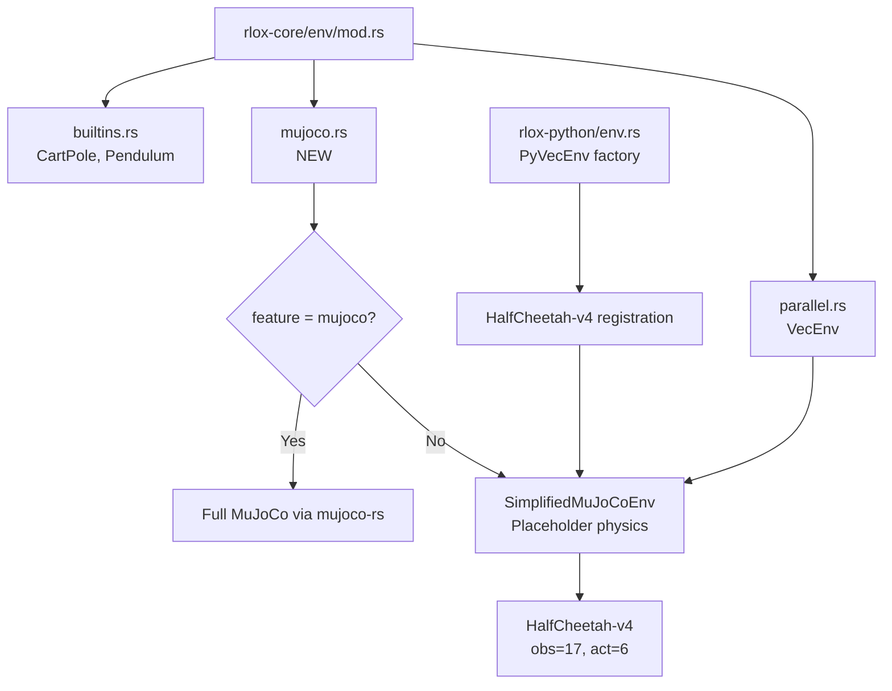

# MuJoCo Native Binding Infrastructure Plan

## Overview
Set up MuJoCo environment infrastructure behind a `mujoco` feature flag. Since MuJoCo C library is not installed, implement a `SimplifiedMuJoCoEnv` that validates the architecture with placeholder physics.

## Architecture

## Tasks

```mermaid
gantt
    title Implementation Steps
    dateFormat X
    axisFormat %s

    section Core
    Add feature flag to Cargo.toml       :t1, 0, 1
    Create env/mujoco.rs                  :t2, 1, 4
    Register in mod.rs                    :t3, 4, 5

    section Python
    Register HalfCheetah in PyVecEnv      :t4, 5, 6

    section Tests
    Unit tests for SimplifiedMuJoCoEnv    :t5, 4, 7
    VecEnv integration test               :t6, 7, 8
    cargo test verification               :t7, 8, 9
```

## HalfCheetah-v4 Spec (Simplified)
- **obs_dim**: 17 (matching Gymnasium HalfCheetah)
- **act_dim**: 6 (matching Gymnasium HalfCheetah)
- **Action space**: Box([-1.0; 6], [1.0; 6])
- **Dynamics**: `next_state = state + dt * action_effect` (placeholder linear)
- **Reward**: forward velocity (state[8], the x-velocity component)
- **max_steps**: 1000
- **dt**: 0.05

## Feature Flag Design
- `mujoco` feature on `rlox-core`: when enabled, would pull in `mujoco-rs` dep
- Without feature: `SimplifiedMuJoCoEnv` always available for testing
- Python side: always uses simplified env for now, full MuJoCo gated later
