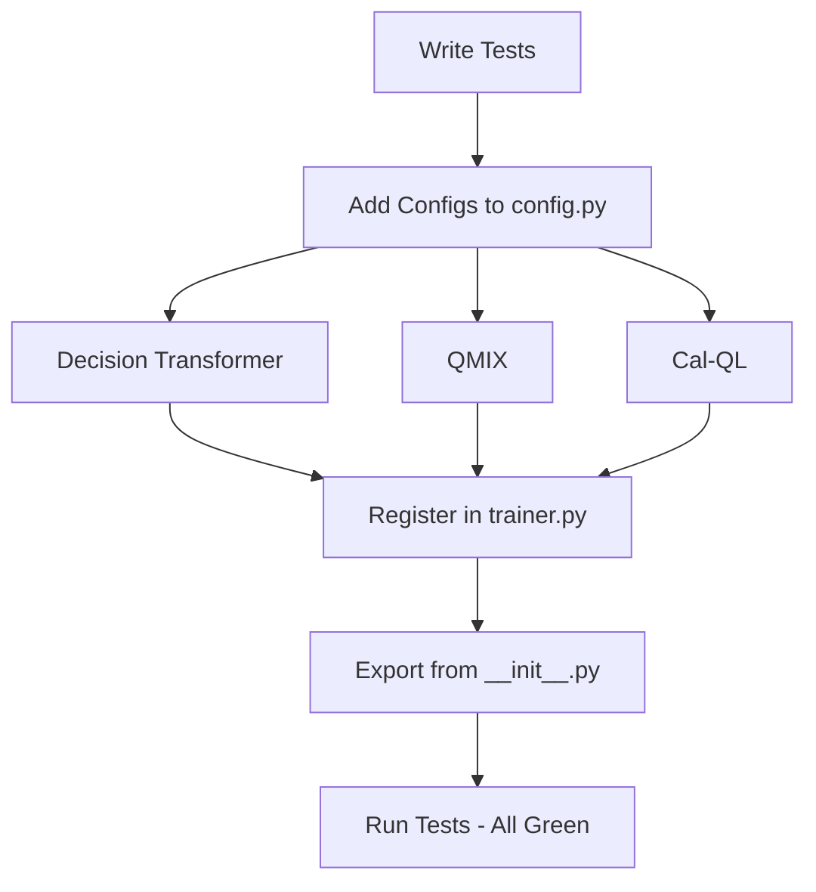
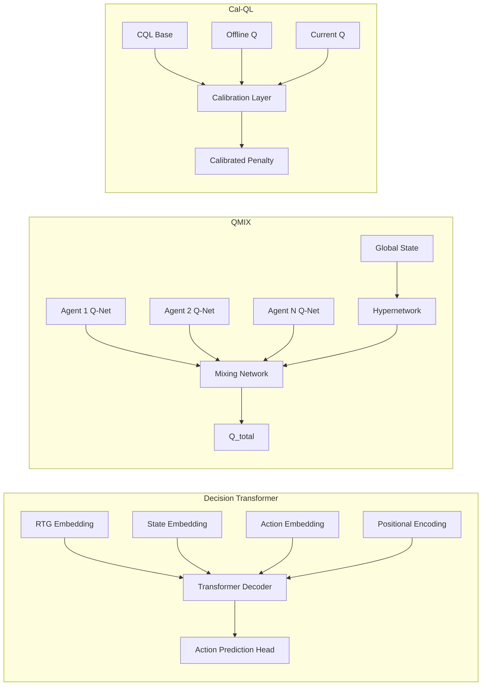
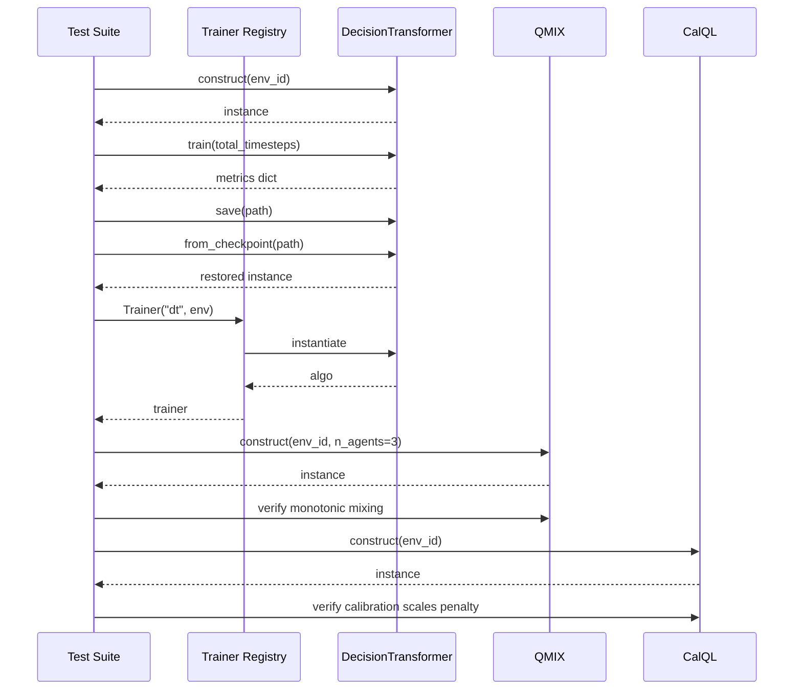

# New Algorithms Implementation Plan

## Algorithms: Decision Transformer, QMIX, Cal-QL

### Implementation Order (TDD)

1. Write all tests first (`tests/python/test_new_algorithms.py`)
2. Add config dataclasses to `python/rlox/config.py`
3. Implement Decision Transformer (`python/rlox/algorithms/decision_transformer.py`)
4. Implement QMIX (`python/rlox/algorithms/qmix.py`)
5. Implement Cal-QL (`python/rlox/algorithms/calql.py`) -- CQL + calibration (no existing CQL)
6. Register all in `trainer.py` and export from `__init__.py`
7. Run tests, iterate until green

### Architecture

### Sequence Diagram

