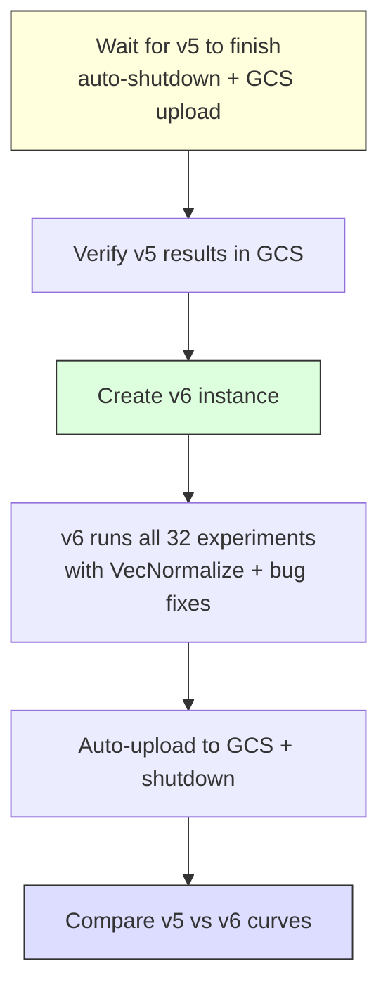

# V6 Convergence Benchmark Launch Plan

## V5 Status

| Item | Value |
|------|-------|
| Instance | `rlox-convergence-v5` (us-central1-c) |
| Uptime | ~2.5 days |
| Commit | `84c9a32` (Fix startup script) |
| VecNormalize | **Not present** — v5 predates all bug fixes |
| Experiments | 31 of 32 started |
| Currently running | `rlox | sac_humanoid | seed=0` (last rlox experiment) |
| Remaining after | `sb3 | sac_humanoid | seed=0` (1 experiment left) |
| Results saved | 31 JSON files in `/tmp/rlox/results/convergence/` |

**The sac_humanoid rlox run is at step ~1.33M and climbing at 45 SPS (~8h/M steps). It will finish within hours, then sb3_humanoid runs, then v5 auto-uploads to GCS and shuts down.**

## Decision: Let V5 Finish

V5 is on experiment 31/32 — it will complete on its own shortly (estimate: 6-12 hours max). The v5 data is still valuable as a **pre-fix baseline**. No reason to kill it.

## Commits Missing from V5 (Bug Fixes for V6)

```
dd34e84 Add VecNormalize env wrapper for obs/reward normalization
b1379a4 Fix reward normalization order: normalize before truncation bootstrap
7598242 Fix 6 convergence bugs: truncation bootstrap, per-dim normalization, reward scaling
```

Plus 20+ other commits (docs, architecture, Candle, etc.).

## V6 Launch Plan

```mermaid
gantt
    title V5 Completion + V6 Launch Timeline
    dateFormat HH:mm
    axisFormat %H:%M

    section V5 (auto)
    sac_humanoid rlox      :active, v5a, 00:00, 6h
    sb3_humanoid            :v5b, after v5a, 4h
    GCS upload + shutdown   :v5c, after v5b, 1h

    section V6
    Create instance         :v6a, after v5c, 1h
    Run 32 experiments      :v6b, after v6a, 48h
    GCS upload + shutdown   :v6c, after v6b, 1h
```





## Commands to Launch V6

### Step 1: Verify v5 results landed in GCS (after v5 shuts down)

```bash
gcloud storage ls "gs://rkox-bench-results/" | grep convergence | sort | tail -5
```

### Step 2: If v5 hasn't shut down yet but you want to pull results early

```bash
# Pull v5 results locally
gcloud compute scp --recurse \
  rlox-convergence-v5:/tmp/rlox/results/convergence/ \
  ./results/convergence-v5/ \
  --zone=us-central1-c --project=rkox-bench
```

### Step 3: Create v6 instance (same spec as v5)

```bash
gcloud compute instances create rlox-convergence-v6 \
  --zone=us-central1-c \
  --project=rkox-bench \
  --machine-type=n2-standard-8 \
  --image-family=ubuntu-2204-lts \
  --image-project=ubuntu-os-cloud \
  --boot-disk-size=50GB \
  --boot-disk-type=pd-ssd \
  --scopes=storage-rw \
  --metadata-from-file=startup-script=scripts/gcp-convergence-bench.sh
```

> **Note**: The startup script (`scripts/gcp-convergence-bench.sh`) clones the repo fresh from GitHub, so v6 will automatically get the latest `main` with all bug fixes including VecNormalize. No need to manually pull code.

### Step 4: Monitor v6

```bash
# Check if container is running
gcloud compute ssh rlox-convergence-v6 --zone=us-central1-c --project=rkox-bench \
  --command="sudo docker ps"

# Tail logs
gcloud compute ssh rlox-convergence-v6 --zone=us-central1-c --project=rkox-bench \
  --command="sudo docker logs --tail 10 \$(sudo docker ps -q) 2>&1"

# Check experiment progress
gcloud compute ssh rlox-convergence-v6 --zone=us-central1-c --project=rkox-bench \
  --command="sudo docker logs \$(sudo docker ps -q) 2>&1 | grep 'Running:' | wc -l"
```

### Step 5: After v6 completes, compare results

```bash
# Pull both from GCS
gcloud storage cp -r "gs://rkox-bench-results/convergence-<v5-timestamp>/" results/v5/
gcloud storage cp -r "gs://rkox-bench-results/convergence-<v6-timestamp>/" results/v6/

# Run analysis
python benchmarks/convergence/analyze.py --dirs results/v5 results/v6 --labels "pre-fix" "post-fix"
```

## Key Risks

1. **Startup script clones `main`** -- make sure all fixes are pushed to GitHub before launching v6
2. **v5 might not auto-shutdown** if the upload fails -- check instance status after ~12h
3. **Cost**: n2-standard-8 at ~$0.39/hr = ~$19 for 48h run. Delete the instance if it doesn't auto-shutdown.
